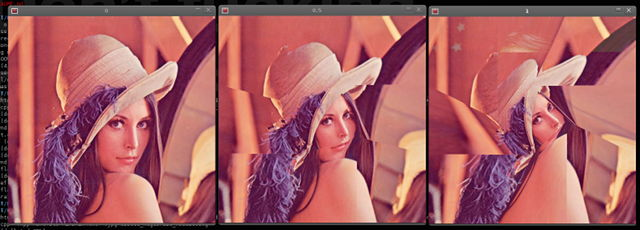
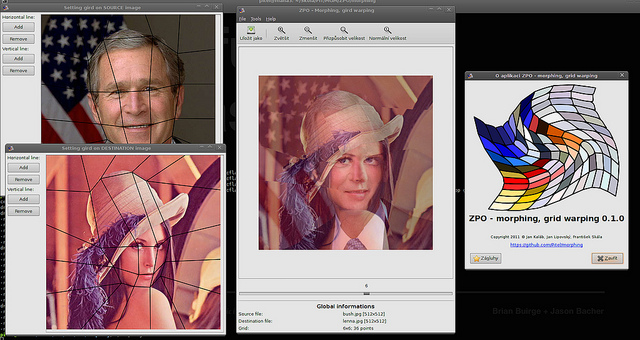

Zpracování obrazu: Morphing
===========================

Řešitelé
--------
* Bc. Jan Kaláb (xkalab00)
* Bc. Jan Lipovský (xlipov00)
* Bc. František Skála (xskala05)

Zadání
------
Vytvořte aplikaci realizující morphing s použitím síťového warpingu, kde řídící síť se skládá z úseček. Navrhněte uživatelsky příjemné rozhraní pro snadnou editaci řídící sítě.

Datum vypracování
-----------------

1. května 2011

Popis řešení projektu
---------------------
Morphing je kombinaci warpingu 2 obrázků proti sobě a jejich následného blendingu.

Na počátečním a koncovém obrázku je nejdříve vyznačena síť, která vytváří konvexní čtyřúhelníkové dlaždice (na každém obrázku jinak, ale hustota sítě je stejná). Ideálně by uzly této sítě měly vyznačovat stejná místa na obou obrázcích (oči, ústa, apod.). Během morphingu je pak původní obrázek postupně warpován na síť koncového obrázku, a naopak koncový obrázek je nejdříve zwarpován podle sítě počátečního obrázku a následně se vrací do normálu. Warpované obrázky jsou navíc během morphingu blendovány s různými koeficienty tak, aby jeden přecházel do druhého.

Při vhodně zvolených uzlových bodech je tak výsledkem morphingu např. plynulý přechod jednoho obličeje do druhého. Kvalita morphingu pak závisí především na hustotě sítě.

### Warping ###

Na obrázku výše můžete vidět jak postupně probíhá síťový warping. Warping je vlastně libovolná obecná geometrická transformace obrazu. Poněvadž pracujeme se čtyřúhelníky, rozhodli jsme se použít operace perspektivní tranformace. Ta je totiž v knihovně OpenCV velice dobře podporována. Stačí pomocí funkce `getPerspectiveTransform` ze dvou polí se čtyřmi body vygenerovat transformační matici, a poté pomocí funkce `warpPerspective` provést samotnou transformaci. Následně jen stačí zadaný polygon vymaskovat, a přidat k výslednému obrazu.

Bohužel, perspektivní korekce neprovádí změny tak lokálně, jak bychom rádi. Pokud na obdélníku změníme pouze jeden jeho vrchol, celý obrázek se *zkroutí*. Na obrázku výše si tohoto jevu můžete povšimnout na nevazaujících hranách kloubouku a ramene. Tato vada ovšem není tak patrná, pokud je síť dostatečně hustá, a změny v sítích nejsou příliš velké. Tudíž pro morphing dvou obličejů je perspektivní transformace dostačující.

Také jsme přemýšleli o vyžití mapování mapování textur v OpenGL, ale nakonec jsme tuto variantu zavrhli, a zůstali u knihovny OpenCL.

Popis obsluhy programu
----------------------

TODO

Zhodnocení výsledků
-------------------
TODO

Použitá literatura
------------------
* [OpenCV 2.1 C++ Reference](http://opencv.willowgarage.com/documentation/cpp/index.html)
* [Transformation matrix - Wikipedia](http://en.wikipedia.org/wiki/Transformation_matrix)
